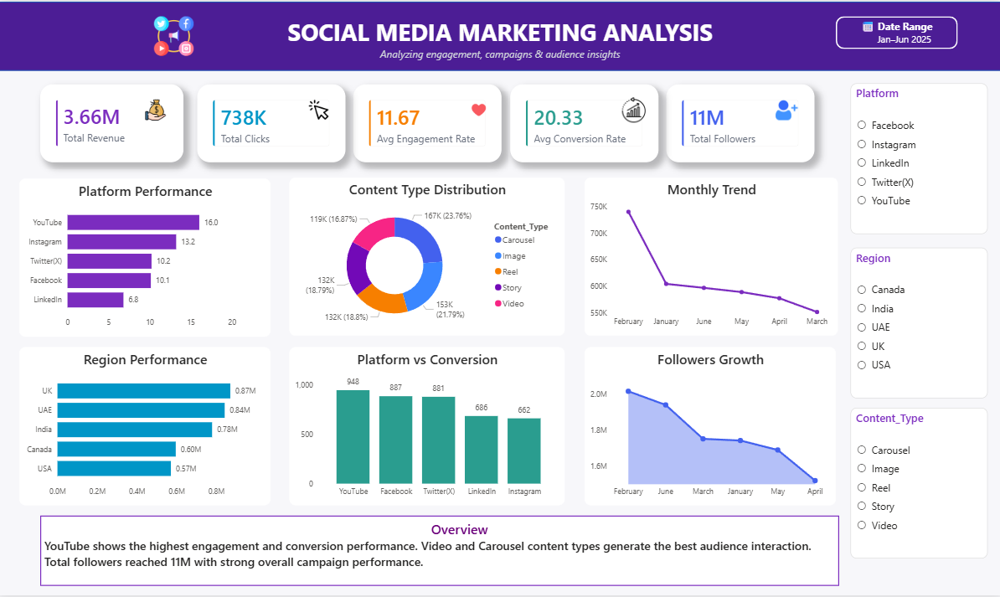

# Social Media Marketing Analysis Dashboard

## Project Overview

This project presents an interactive **Social Media Marketing Analysis Dashboard** developed using **Power BI, Microsoft Excel, and DAX** to analyze social media campaign performance across different platforms, regions, and content types.

The dashboard transforms marketing data into actionable insights by analyzing **revenue, clicks, engagement, conversions, follower growth, platform performance, and regional trends**. It helps businesses evaluate campaign effectiveness and make data-driven marketing decisions.

---

## Dashboard Pages

### 📈 Social Media Marketing Analysis

The dashboard provides a comprehensive overview of social media marketing performance through interactive KPIs and visualizations.

**KPIs**

* Total Revenue
* Total Clicks
* Average Engagement Rate
* Average Conversion Rate
* Total Followers

**Visualizations**

* Platform Performance
* Content Type Distribution
* Monthly Performance Trend
* Region-wise Performance
* Platform vs Conversion Analysis
* Followers Growth Analysis

---

## Dashboard Features

* Interactive KPI cards
* Platform-wise performance analysis
* Content type performance analysis
* Monthly trend analysis
* Region-wise performance comparison
* Revenue and conversion analysis
* Followers growth tracking
* Interactive slicers and filters
* Clean and business-focused dashboard design
* Interactive charts and visualizations
* Data-driven marketing performance analysis

---

## Tools & Technologies

* **Power BI** – Dashboard development and data visualization
* **Microsoft Excel** – Data cleaning and preparation
* **DAX** – Calculated measures and KPI development

---

## Key Insights

* **YouTube** shows the highest engagement and conversion performance among the analyzed platforms.
* **Video and Carousel** content types generate strong audience interaction.
* Total campaign revenue reached approximately **3.66M**.
* The campaigns generated approximately **738K clicks**.
* Total followers reached approximately **11M**, indicating strong audience reach.
* Regional analysis helps identify areas with stronger campaign and revenue performance.
* Platform-wise conversion analysis helps identify the most effective social media channels.
* Monthly trend analysis provides visibility into changes in campaign performance over time.
* Interactive filters allow users to compare platforms, regions, and content types for better marketing decisions.

---

## Author

### **Archana**

**Data Analyst | Excel | SQL | Python | Power BI**

Passionate about building interactive dashboards and transforming data into actionable insights.

🔗 **LinkedIn:** [www.linkedin.com/in/archana-ramesh-](http://www.linkedin.com/in/archana-ramesh-)
